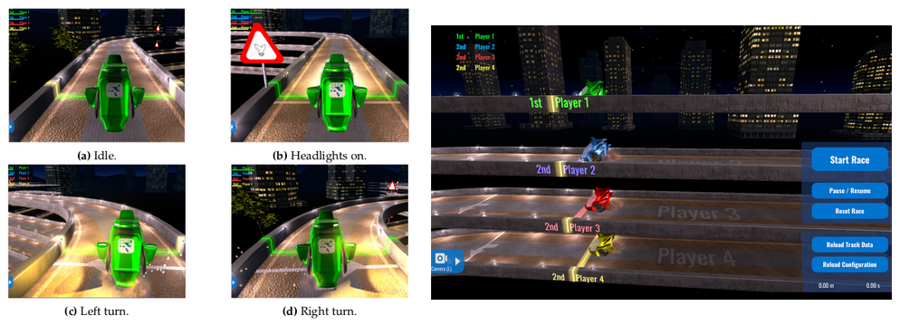
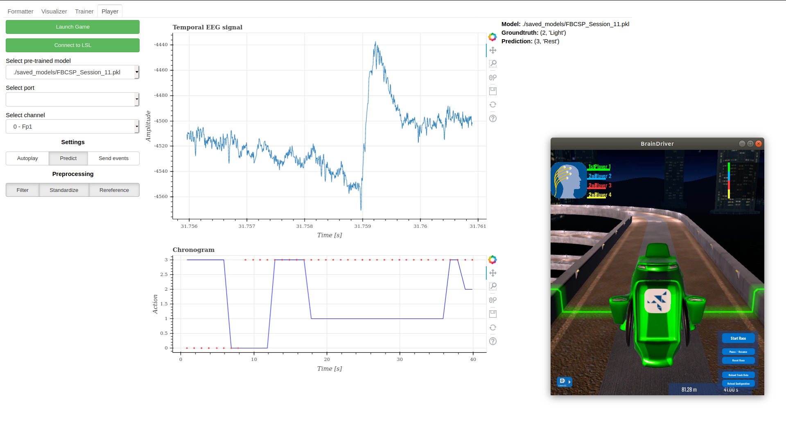

# Leveraging Deep Learning for Real-time EEG Classification at Cybathlon's BCI-race
**Frédéric Debraine**, April 2020

This repository contains the code, reports and presentation slides of my master thesis carried out in NCM Lab at ETHZ between March and September 2019 under the supervision of Prof. Dr. Nicole Wenderoth and Ernest Mihelj.

This work aspires to propose a fully functional Brain Computer Interface (BCI) composed of the following elements:
- An offline pipeline for the training and development phase that will take care
of formatting, loading, preprocessing the data, extract features using one of the
multiple proposed methods, train, validate and optimize the model.
- An online pipeline in which we will benchmark our trained models with relevant metrics regarding the real-time Cybathlon competition.
- Visualization tools for offline/online analysis comprising signal and embedding representation, model inference and metrics to provide better interpretability and easier debugging.


**Presentations slides:**
- [Mid-term presentation](https://docs.google.com/presentation/d/1M7-L-o8VcEkF2XUpg1tlzHjlhS4FAOSxXEdc2CnIoFg/edit?usp=sharing)
- [Final presentation](https://docs.google.com/presentation/d/1VI9dcGJZGvR_Vj2vGMXPnahVWyrGI8pWVup2zn4acWY/edit?usp=sharing)

**Colab Notebooks:**
- [Benchmarking - Competition dataset](https://colab.research.google.com/drive/1QLnWBQ0ZXnaVCvoCr--Ro8In2sOHnuE9)
- [Benchmarking - BCIC dataset](https://colab.research.google.com/drive/1cRHG0g0a_X-yfjg7U_QXlCQ4idBmjHNm)

*Remark:* You need to have the `./Datasets/` folder on your Google Drive before running the Colab notebooks. 
The `data_path` parameter should be adapted to your path once your Drive has been mounted.
Create a local copy of the notebooks before running them and change runtime type to GPU (runtime -> change runtime type).





## 1. Installation
- ***1. Download Anaconda (Python 3.7 distribution):*** [conda 4.7.12](https://www.anaconda.com/distribution/)
- ***2. Clone/download the current repository***
- ***3. Create Conda environment:***
	- `conda create -n cybathlon`
	- `conda activate cybathlon`
- ***4. Install dependencies:***
	- `pip install -r requirements.txt`
	- `pip install -e .`

## 2. Getting the data

### Datasets
- **BCI Competition 2008 (BCIC IV 2a/b):** [Description 2a](http://www.bbci.de/competition/iv/desc_2a.pdf) - [Description 2b](http://www.bbci.de/competition/iv/desc_2b.pdf) - [Data](http://bbci.de/competition/iv/index.html#download) - [Test labels](http://www.bbci.de/competition/iv/results/index.html#labels)
- **Competition data (Pilots):** Internal

### Folder structure
```
master-thesis-cybathlon
└── code
└── Datasets
    ├── BCI_IV_2a
    │    └── gdf
    │        ├── test
    │        │    ├── labels
    │        │    │    ├── A01E.mat
    │        │    │    ├── ...
    │        │    │    └── A09E.mat
    │        │    ├── A01E.gdf
    │        │    ├── ...
    │        │    └── A09E.gdf
    │        └──  train
    │            ├── A01T.gdf
    │            ├── ...
    │            └── A09T.gdf
    ├── BCI_IV_2b  #(idem)
    └── Pilots
        ├── Pilot_1
        └── Pilot_2
            ├── Session_1
            ├── ...
            └── Session_8
                └── vhdr
                    ├── ***.eeg
                    ├── ***.vhdr
                    └── ***.vmrk
```

## 3. Launching the visual interface
- `conda activate cybathlon`
- `bokeh serve bokeh_dashboard --show`


